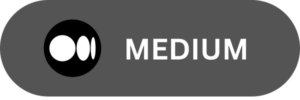

<h2 align="center">Hi there 👋</h2>

Welcome to my GitHub! I'm Goksel Yesiller, a System Engineering graduate who's
transitioning into Software Engineering through self-study. I create awesome MERN projects.

  

* [Personal Website](https://gokselyesiller.netlify.app/)

* [Personal CV](resume/GOKSEL-CV.pdf)

  

✔️ I'm currently learning and developing on  --> **Javascript** - **ReactJS** - **NodeJS** - **Docker** - **Solidity** - **Web3** 
  

<h2 align="center">:open_file_folder: PROJECTS :open_file_folder:</h2>

  <table align="center"> 
      <tr>
        <td><h3>HTML Studies</h3></td>
        <td><h3>React Projects</h3></td>
        <td><h3>Nodejs Projects</h3></td>
      </tr> 
      <tr>
        <td>
          <ul>
          <li>    
            <a
              href="https://github.com/mryesiller/Talecraft_Guide_WebSite"
              target="blank"
              title="Talecraft"        
            >Talecraft Guide Website</a        
          </li>
          <li>    
            <a
              href="https://mryesiller.github.io/HTML-ThemeClock/"
              target="blank"
              title="ThemeClock"        
            >ThemeClock</a        
          </li>
          <li>    
            <a
              href="https://mryesiller.github.io/HTML_GithubProfiles/"
              target="blank"
              title="GithubProfiles"        
            >Github Profiles</a        
          </li>
          <li>    
            <a
              href="https://mryesiller.github.io/HTML_Hoverboard/"
              target="blank"
              title="Hoverboard"        
            >Hoverboard</a        
          </li>
          <li>    
            <a
              href="https://mryesiller.github.io/HTML_Pokedex/"
              target="blank"
              title="Pokedex"        
            >Pokedex</a        
          </li>
          <li>    
            <a
              href="https://mryesiller.github.io/HTML_3D_BOXES/"
              target="blank"
              title="3DBoxes"        
            >3D Boxes</a        
          </li>
          <li>    
            <a
              href="https://mryesiller.github.io/HTML_TodoApp/"
              target="blank"
              title="TodoApp"        
            >Todo App</a        
          </li>  
          <li>    
            <a
              href="https://mryesiller.github.io/sass-framework-project/"
              target="blank"
              title="Sass-Framework"        
            >Sass css framework</a        
          </li> 
      </ul>  
        </td>  
        <td>
          <ul>
            <li>    
              <a
                href="https://delightful-florentine-0e0912.netlify.app/"
                target="blank"
                title="TodoApp"        
              >Todo App</a        
            </li>
            <li>    
              <a
                href="https://mryesiller-react-weatherapp.herokuapp.com/"
                target="blank"
                title="WeatherApp"        
              >Weather App</a        
            </li>
            <li>    
              <a
                href="https://golden-zuccutto-812ec2.netlify.app/"
                target="blank"
                title="MusicPlayer"        
              >Music Player</a        
            </li>
            <li>    
              <a
                href="https://zustand-example.netlify.app/"
                target="blank"
                title="Zustand-TodoApp"        
              >Zustand-TodoApp</a        
            </li>
            <li>    
              <a
                href="https://github.com/mryesiller/mern-auth-boilerplate"
                target="blank"
                title="MERN auth with zustand"        
              >MERN-auth-boiler with Zustand-context </a        
            </li>
            <li>    
              <a href="https://react-tictactoe-zustand.netlify.app/"
                target="blank"
                title="tic-tac-toe"        
              >Tic-Tac-Toe </a        
            </li>
             <li>    
              <a href="https://popupsmart-react-practicum.netlify.app/login"
                target="blank"
                title="todo-app-CRUD"        
              >Popupsmart react practicum </a        
            </li>
             <li>    
              <a href="https://fimple-react-practicum.netlify.app/"
                target="blank"
                title="Credit Calculator"        
              >Fimple Practicum Credit Calculator </a        
            </li>
          </ul>  
        </td>            
        <td>
          <ul>
            <li>    
              <a
                href="https://nodemailer-expressjs.herokuapp.com/"
                target="blank"
                title="Nodemailer"        
              >Nodemailer with Express</a        
            </li>
            <li>    
              <a
                href="https://gusto-finalproject.herokuapp.com"
                target="blank"
                title="Patika Bootcamp Project"        
              >Bootcamp Final Project</a        
            </li>
          </ul>
        </td>  
     </tr>      
  </table>      

  

<h2 align="center">:trident: TECH STACK :trident:</h2>

<h2 align="center">🔥 TOOLS I use during the day 🔥</h2>
 

              
              
              
              

<h2 align="center">⚡ Connect With Me ⚡</h2>
 
              

 
 

             
              
           

<h2 align="center">⚡ Recent Activity ⚡</h2>
              

<b> &#9749; Latest Medium Blogs</b>

              
<a target="_blank" href="https://github-readme-medium-recent-article.vercel.app/medium/@gokselyesiller/0">

  

 
  
  <h2 align="center">⚡ Github Stats ⚡</h2>
 

  

   

  

    

      

